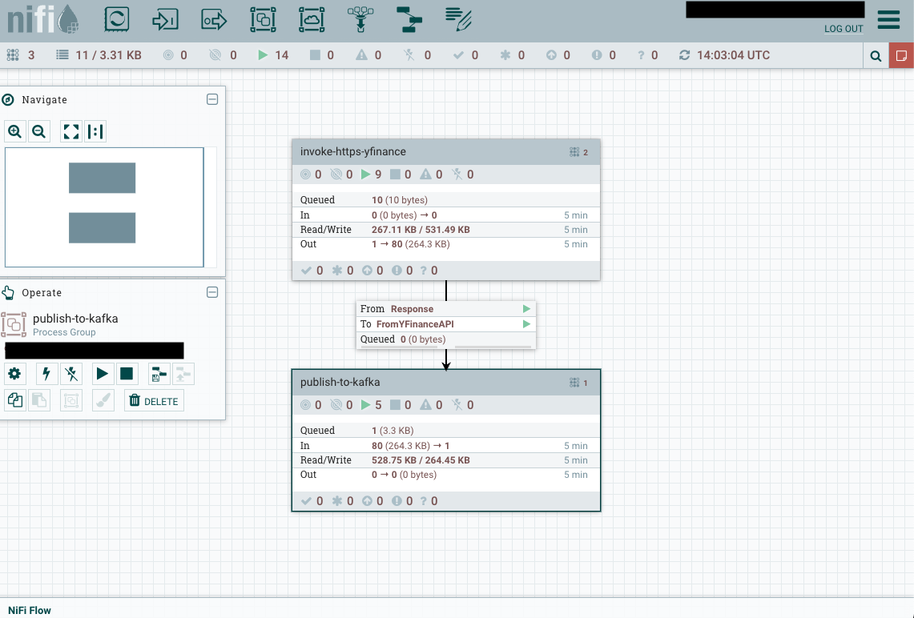
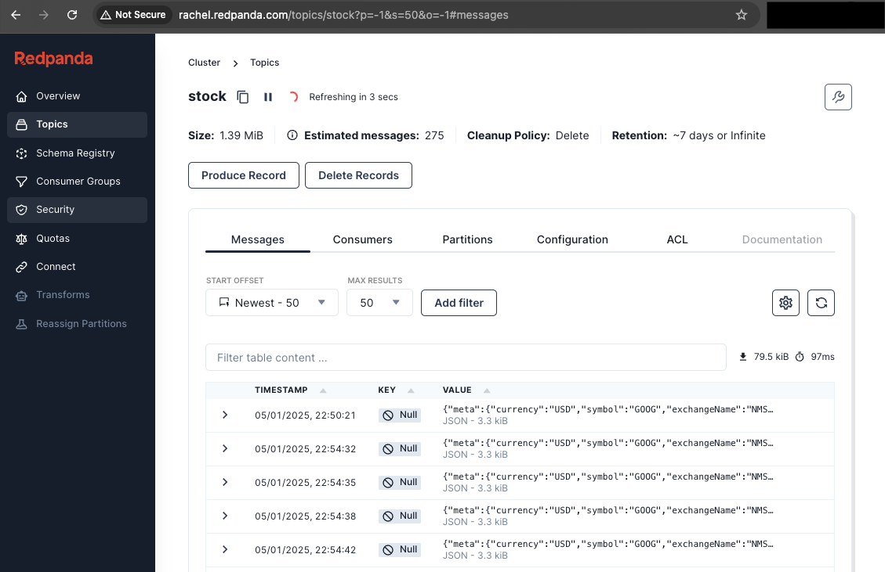

# data-streaming-on-k8s
# Intro
This exercise focuses on building a robust data streaming pipeline deployed on Kubernetes using AWS EKS. The pipeline integrates multiple components to enable real-time data ingestion, processing, and analytics, specifically tailored for stock market data streaming:

- **[Nifi](user-content-part-3---nifi)**: Extracts stock data from the Yahoo Finance API at 1-second intervals and streams it to a Kafka topic for real-time processing.
- **[Kafka(Strimzi)](user-content-part-4---kafka)**: A distributed and decoupled event streaming platform designed for high-throughput, fault-tolerant data ingestion and real-time analytics.
- **[Kafka Connect(Strimzi)](user-content-c-deploy-kafka-connect)**: Facilitates seamless integration between Kafka and external systems, enabling efficient data ingestion and export through pre-built or custom connectors.
- **[Snowflake Sink Connector for Kafka](user-content-e-deploy-kafka-connector)**: Streams data from Kafka topics into Snowflake in real time for analytics and long-term storage.
- **[Kafka UI (Redpanda Console)](user-content-f-deploy-redpanda-console)**: Offers an intuitive interface for monitoring and managing Kafka clusters, topics, consumer groups, and messages in real time.
- **[Snowflake](user-content-part-5---write-to-snowflake)**: A cloud-native data platform that provides scalable, secure, and high-performance capabilities for data warehousing, analytics, and sharing.
# Architecture

Data flow:
 

AWS building blocks:
 

**VPC:**
- **4 subnets (2 public, 2 private)** are set up for high availability and redundancy across 2 different Availability Zones (AZ).
- **Internet Gateway (IGW)** enables internet connectivity for resources in the public subnets.
- The EKS cluster spans across 4 subnets (2 public + 2 private subnets).

**Public Subnets:**
- used for internet-facing resources.
- **Application load balancer (ALB)** gets direct internet access through IGW.
- **NAT Gateway** to allow internet access for the resources in the private subnets. For example, EBS CSI driver requires outbound internet access to interact with AWS API to provision EBS volumes; load balancer controller communicates with AWS API to provision ALB.

**Private Subnets:**
- to ensure **Node groups** (k8s worker nodes) are not exposed directly to the internet.
- **Application pods** (Nifi, Kafka,...) are deployed on the private worker nodes.
- Common resources **EBS CSI driver pods** and **load balancer controller pods** are also deployed on the private worker nodes.

**Secure architecture**
- **Ingress Traffic**: Nodes are deployed in private subnets, with Application Load Balancers (ALB) placed in public subnets to handle all incoming internet traffic. The ALB securely routes requests to applications in the private subnets, ensuring that the nodes remain isolated and are not directly exposed to the internet.
- **Egress Traffic**: A NAT Gateway is deployed in the public subnets and associated with the route tables of the private subnets. This setup allows the nodes in private subnets to securely access the internet for outbound traffic (e.g., pulling updates or accessing APIs) while keeping them inaccessible from external networks.
# Prerequisites
Install the followings in advance.
- aws CLI
- eksctl
- kubectl
- helm

# Part 1 - EKS cluster + Private Node Group

1. Launch EKS cluster using the given template [eks.yaml](cloudformation/eks.yaml), replacing `ap-northeast-2` with desired aws region.
```bash
aws cloudformation create-stack --stack-name MyEKSClusterStack --template-body file://project_folder/cloudformation/eks.yaml --capabilities CAPABILITY_NAMED_IAM --region ap-northeast-2
```

2. Wait until EKS cluster is ready. Navigate to AWS console, from the CloudFormation output, copy a few values:

- VpcId
- ControlPlaneSecurityGroup
- PrivateSubnetIds

Then paste the values to [params.json](cloudformation/params.json). This file contains the input parameters required to create the node group.  

3. Launch the node group using the given template [nodegroup-private.yaml](cloudformation/nodegroup-private.yaml).
```bash
aws cloudformation create-stack --stack-name MyPrivateNodeGroupStack --template-body file://project_folder/cloudformation/nodegroup-private.yaml --parameters file://project_folder/cloudformation/params.json --capabilities CAPABILITY_NAMED_IAM --region ap-northeast-2
```

4. Wait until the node group is ready. Update kubeconfig to enable the `kubectl` CLI to communicate w/ the EKS cluster.
```bash
aws eks update-kubeconfig --region ap-northeast-2 --name MyEKSCluster
```

5. To enable the nodes to join the cluster, prepare an aws-auth ConfigMap. Download [aws-auth-cm.yaml](auth/aws-auth-cm.yaml) from aws and replace the `rolearn` value with the `NodeGroupRole Arn` value obtained from Cloudformation output (MyPrivateNodeGroupStack). Then check and wait until the nodes are ready.

- download `aws_auth-cm-yaml` template from aws. 
```bash
curl -O https://s3.us-west-2.amazonaws.com/amazon-eks/cloudformation/2020-10-29/aws-auth-cm.yaml
```
- edit `aws_auth-cm-yaml` and apply.
```bash
kubectl apply -f project_folder/auth/aws-auth-cm.yaml

kubectl get nodes --watch
```


---
# Part 2 - EBS CSI driver and Load Balancer Controller
### EBS CSI driver
To enable Dynamic Volume Provisioning, install EBS CSI driver in advance.

1. Create OIDC for the EKS cluster
```bash
eksctl utils associate-iam-oidc-provider --cluster MyEKSCluster --approve
```
2. Create service account. Check cloudformation stack `eksctl-MyEKSCluster-addon-iamserviceaccount-kube-system-ebs-csi-controller-sa`.
```bash
eksctl create iamserviceaccount --name ebs-csi-controller-sa --namespace kube-system --cluster MyEKSCluster  --role-name AmazonEKS_EBS_CSI_DriverRole --role-only --attach-policy-arn arn:aws:iam::aws:policy/service-role/AmazonEBSCSIDriverPolicy  --approve   
```
3. Wait until the service account is ready. Then helm install EBS CSI Driver.
```bash
helm repo add aws-ebs-csi-driver https://kubernetes-sigs.github.io/aws-ebs-csi-driver

helm repo update  

helm install aws-ebs-csi-driver aws-ebs-csi-driver/aws-ebs-csi-driver --namespace kube-system  --set serviceAccount.controller.create=false  --set serviceAccount.controller.name=ebs-csi-controller-sa
```
### AWS Load Balancer Controller
The controller manages AWS Elastic Load Balancers for the Kubernetes cluster. We need this controller to help create ALB so that nifi can be accessed via ingress entry.

1. Create OIDC (can skip since we have created the OIDC in CSI Driver section.)
```bash
eksctl utils associate-iam-oidc-provider --cluster MyEKSCluster --approve
```
2. Download & create IAM policy required for the load balancer controller to interact with AWS.
   (Go to [Troubleshoot](user-content-troubleshoot) section, there are missing policies in the AWS provided policy.)
```bash
curl -O https://raw.githubusercontent.com/kubernetes-sigs/aws-load-balancer-controller/v2.7.2/docs/install/iam_policy.json

aws iam create-policy \
--policy-name AWSLoadBalancerControllerIAMPolicy \
--policy-document file://project_folder/auth/iam_policy.json
```
   This is the edited version: [iam_policy.json](auth/iam_policy.json).
   After creating the IAM policy, copy the policy ARN of `AWSLoadBalancerControllerIAMPolicy` from AWS IAM.
   
3. Create service account. The `eksctl` command will create service account `aws-load-balancer-controller` and IAM role `AmazonEKSLoadBalancerControllerRole`. The service account will be linked with the IAM role, containing the IAM policy `AWSLoadBalancerControllerIAMPolicy`(copy the policy ARN from AWS IAM). Check the cloudformation stack `eksctl-MyEKSCluster-addon-iamserviceaccount-kube-system-aws-load-balancer-controller`.
```bash
eksctl create iamserviceaccount  --cluster=MyEKSCluster --namespace=kube-system --name=aws-load-balancer-controller  --role-name AmazonEKSLoadBalancerControllerRole  --attach-policy-arn=arn:aws:iam::xxxxxxxx:policy/AWSLoadBalancerControllerIAMPolicy  --approve  
```

4. Wait until the service account is ready. Then helm install aws-load-balancer-controller
```bash
helm repo add eks https://aws.github.io/eks-charts

helm repo update

helm install aws-load-balancer-controller eks/aws-load-balancer-controller  -n kube-system --set clusterName=MyEKSCluster  --set serviceAccount.create=false  --set serviceAccount.name=aws-load-balancer-controller
```

5. Verify if the controllers are installed properly. Check `aws-load-balancer-controller` and `aws-ebs-csi-driver` from the output.
```bash
kubectl get deployment -n kube-system 
```


---
### Troubleshoot
##### issue # 1

_What:_ Failed during `helm install aws-load-balancer-controller...` 

_Why:_ Permission error: Missing IAM policies for Load Balancer Controller service account.
```
Failed deploy model due to operation error Elastic Load Balancing v2: DescribeListenerAttributes, https response error StatusCode: 403, RequestID: xxxxx-xxx-xxx-xxx-xxxx, api error AccessDenied: User: arn:aws:sts::xxxxxxxx:assumed-role/AmazonEKSLoadBalancerControllerRole/xxxxxxxxxx is not authorized to perform: elasticloadbalancing:DescribeListenerAttributes because no identity-based policy allows the elasticloadbalancing:DescribeListenerAttributes action
```
_How to solve:_ 
This seems a bug (not sure). You need to add the following policies to `iam_policy.json` , then recreate the IAM policy and service account `aws-load-balancer-controller`.
```
Action:
    - elasticloadbalancing:DescribeListenerAttributes
    - elasticloadbalancing:ModifyListenerAttributes
Resource: "*"
```
Details: Delete the existing `eksctl-MyEKSCluster-addon-iamserviceaccount-kube-system-aws-load-balancer-controller` cloudformation stack -> delete & recreate IAM policy -> eksctl create service account with IAM role attached with updated policy -> recreate AWS Load Balancer Controller using `helm` with the updated service account
*ref: https://github.com/eksctl-io/eksctl/issues/7987

---
# Part 3 - Nifi
Set up a standalone Nifi application and I will use HTTPS approach to access the Nifi application.
My hostname will be `rachel.nifi.com`.

1. Create namespace
```bash
kubectl create namespace nifi
```
2. Create secret with `tls.key` and `tls.cert`.
```
openssl genrsa -out tls.key 2048

openssl req -new -x509 -key tls.key -out tls.cert -days 360 -subj "/CN=rachel.nifi.com"

kubectl create secret tls tls-secret --cert=tls.cert --key=tls.key -n nifi
```
Remarks: If `openssl.cnf` is not available, you can download a sample OpenSSL configuration file from [OpenSSL GitHub](https://github.com/openssl/openssl/blob/master/apps/openssl.cnf) and add the configuration file using `-config` flag.
```
openssl req -new -x509 -key tls.key -out tls_r.cert -days 360 -subj "/CN=rachel.nifi.com" -config folder/to/openssl.cnf
```

3. Create the essential objects: statefulset, service, pvc, sc, ingress.
```
kubectl apply -f nifi/
```


4. Review the setup and copy username and password from the pod logs
```bash
kubectl -n nifi get pods

kubectl -n nifi logs nifi-0 --tail 50
```


From Nifi pod logs:


5. Get the DNS name of the ingress (ALB) and check for the public IPs of the ALB. 
```bash
kubectl get ingress -n nifi

nslookup k8s-nifi-xxxxx-xxxxx-xxxxx.ap-northeast-2.elb.amazonaws.com
```

Let say the public IPs are 12.34.56.78 and 22.34.56.78 from `nslookup` output.
Copy the IPs and the Nifi hostname to the local hosts file (located at `/etc/hosts` for mac)
```bash
sudo vi /etc/hosts
```
- add below in /etc/hosts
```
12.34.56.78 rachel.nifi.com
22.34.56.78 rachel.nifi.com
```
6. @AWS console, check out the `Load Balancers` page. (we have implemented the load balancer for nifi in step 3.)
- make sure listener has included `443`
- Edit listener `443` -> routing actions select `Return fixed response`->  Certificate source choose `import certificate`->  `import to ACM` option -> paste `tls.key` to Certificate private key and paste `tls.cert` to Certificate body.
- make sure the load balancer security group's inbound rule _allows_ HTTPS 443 traffic.


7. Nifi part is done. Go to the chrome browser and login with the generated username and password obtained from the pod logs.
```
https://rachel.nifi.com/nifi
```


---
# Part 4 - Kafka
Since the introduction of _Kraft_, Zookeeper is no longer required as Kafka nodes can also handle cluster coordination and control natively. In the Kraft mode, the Kafka cluster will consist only of Kafka nodes. But they have different roles — either _controllers, or brokers, or a combination of both._

Taking reference from this AWS [blog](https://aws.amazon.com/blogs/containers/harnessing-karpenter-transitioning-kafka-to-amazon-eks-with-aws-solutions/), I am trying to deploy Strimzi Kafka Operator and Redpanda-Console in this exercise. 
### Why Strimzi?
[Strimzi ](https://strimzi.io/docs/operators/latest/overview#kafka_capabilities) is an open-source project aims to simplify the process of running [Apache Kafka](https://kafka.apache.org/) within a Kubernetes cluster.
### Components to implement
1. **Strimzi Kafka Operator** - open-source Kubernetes Operator that simplifies the deployment, management, and operation of Apache Kafka clusters on Kubernetes.
2. **Kafka Cluster (Kraft)** - 2 custom resources will be deployed: KafkaNodePool and Kafka with Kraft enabled.
3. **Kafka Connect** - a framework included in the Apache Kafka ecosystem that provides scalable and reliable data import and export capabilities for Apache Kafka.
4. **Kafka Connector** - can be either Source connectors that push data into Kafka or Sink connectors that extract data out of Kafka. We will use Snowflake Sink Connector.
5. **Redpanda Console** - user-interface (UI) to manage all Kafka ecosystem modules including brokers, topics, consumers, connectors, users and access in real-time. 
### A. Deploy Strimzi Kafka Operator
To start with Strimzi, we need to implement _Strimzi Kafka Operator_ first. 
1. Create namespace for Kafka
```bash
kubectl create namespace kafka
```
2. Helm install Strimzi Kafka Operator.
```bash
helm repo add strimzi https://strimzi.io/charts/  
helm repo update
helm install strimzi-operator strimzi/strimzi-kafka-operator -n kafka
```
3. Check if the pods are running. You can also follow the logs of the operator.
```bash
kubectl get pods -n kafka

kubectl logs deployment/strimzi-cluster-operator -n kafka -f
```

---
### B. Deploy Kafka cluster [dual-role option]
Once the operator becomes active, we can deploy Kafka cluster. There are different options provided by Strimzi. I will go with the _dual-role_ option to deploy a Kafka cluster with one pool of nodes that _share the broker and controller roles._
  - _controller_: handle cluster **metadata**, including topic configurations, partitions, leader elections, and more.. In KRaft mode, the controller replaces ZooKeeper, so its role is critical for cluster management. Controllers do not handle data (messages).
  - _broker_: handle the **actual data** in the Kafka cluster, such as storing and serving messages for producers and consumers. Each broker manages a subset of partitions for the topics in the cluster. Brokers rely on controllers for metadata.
  - _number of kafka nodes to be deployed = 3_ (share the broker and controller roles)
_Steps_
1. Deploy storage class using [kafka-sc.yaml](kafka/kafka-cluster/kafka-sc.yaml).
```
kubectl apply -f kafka/kafka-cluster/kafka-sc.yaml
```
2. deploy kafka cluster using [kafka-with-dual-role-nodes.yaml](kafka/kafka-cluster/kafka-with-dual-role-nodes.yaml).
```
kubectl apply -f kafka/kafka-cluster/kafka-with-dual-role-nodes.yaml
```
3. check status of pods
```
kubectl get pods -w -n kafka
```

4. You can also check the custom resources status.
	- number of nodes: 3
	- roles: controller, broker
```
kubectl get kafka -n kafka
kubectl get kafkanodepool -n kafka
```


5. Check the service name. The service name of the bootstrap server is  `my-cluster-kafka-bootstrap`, which is designed to provide a single endpoint for Kafka clients to connect to the cluster.
```bash
kubectl get svc -n kafka
```

 => The full url to call the bootstrap server is:
 `my-cluster-kafka-bootstrap.kafka.svc.cluster.local:9092`
6. Test if the Kafka cluster is working properly.
_enter the Kafka container_
```bash
kubectl -n kafka exec -it  my-cluster-dual-role-0  -- bash
```
_test producer_
- (inside container) Produce message and create topic `my-topic` in the meanwhile if not already create
```bash
bin/kafka-console-producer.sh --bootstrap-server my-cluster-kafka-bootstrap:9092 --topic my-topic
```
- Type in any message to send through `my-topic`
_test consumer_
 - (in new kafka shell) Consume message from `my-topic`
```bash
kubectl -n kafka exec -it  my-cluster-dual-role-0  -- bash

bin/kafka-console-consumer.sh --bootstrap-server my-cluster-kafka-bootstrap:9092 --topic my-topic --from-beginning
```
_create topic_
- (inside kafka shell) Create topic named `stock` and create 3 replicas for fault tolerance 
```bash
bin/kafka-topics.sh --bootstrap-server my-cluster-kafka-bootstrap:9092 --create --topic stock --partitions 3 --replication-factor 3
```

_describe topic_
- (within kafka shell) to check the partition/leader/replicas info of the topic `stock`
```
bin/kafka-topics.sh --bootstrap-server my-cluster-kafka-bootstrap:9092 --describe --topic stock
```

---
### C. Deploy Kafka Connect
In `KafkaConnect` resource, we can enable connectors by following the steps below.
- add  `strimzi.io/use-connector-resources` annotation.  
- add a `build` configuration so that Strimzi automatically builds a container image with the connector plugins you require for your data connections.
_Steps_
1. Create private repo at docker hub.
2. Create a file [dockerconfig.json](kafka/kafka-connect/dockerconfig.json) containing encoded username and password.
```JSON
{
	"auths": {
		"https://index.docker.io/v1/": {
			"auth": "xxxxxxxxxxxxxxxxxxxxx"
		}
	}
}
```
_note:_ follow this guide to create the `dockerconfig.json`: 
https://kubernetes.io/docs/tasks/configure-pod-container/pull-image-private-registry/

3. Create Secret which contains the credentials to pull images from the private container registry.
```shell
kubectl -n kafka create secret generic my-docker-secret \
    --from-file=.dockerconfigjson=kafka/kafka-connect/dockerconfig.json \
    --type=kubernetes.io/dockerconfigjson
```
- verify if the secret is correct (return `.dockerconfigjson` contents)
```bash
kubectl -n kafka get secret my-docker-secret --output="jsonpath={.data.\.dockerconfigjson}" | base64 --decode
```

4. In the `KafkaConnect` configuration file:
- initialize the configuration providers (we need this for Kafka connector part)
```
spec: # ... 
config: 
  # ... 
  config.providers: secrets
  config.providers.secrets.class:io.strimzi.kafka.KubernetesSecretConfigProvider
# ...
```
- bake custom Kafka connect image:
	- give the image name: `docker.io/<username>/<private_repo_name>:<tag_version>`
	- `pushSecret` is the secret to access the private container registry.
	- put the download link of snowflake-kafka-connector in the `url` part. (check if the connector version is compatible with the installed Kafka version from snowflake doc)
```
  build:
    output:
      type: docker
      image: docker.io/<username>/<private_repo_name>:<tag_version>
      pushSecret: my-docker-secret
    plugins: 
      - name: snowflake-kafka-connector
        artifacts:
        - type: jar
          url: https://repo1.maven.org/maven2/com/snowflake/snowflake-kafka-connector/2.5.0/snowflake-kafka-connector-2.5.0.jar
```

5. deploy `kafkaconnect` using [kafka-connect.yaml](kafka/kafka-connect/kafka-connect.yaml).
```bash
kubectl apply -f kafka/kafka-connect/kafka-connect.yaml
```
- ref: https://github.com/strimzi/strimzi-kafka-operator/blob/main/examples/connect/kafka-connect.yaml
6. Check pod status.
   Strimzi will first spin-up a Kafka Connect build pod `my-connect-cluster-connect-build` , and when the build is finished a regular Kafka Connect pod `my-connect-cluster-connect-0` is created.
```bash
kubectl get pod -n kafka
```


7. If failed to deploy, check the Kafka Connect logs to debug.
```bash
kubectl describe kafkaconnect my-connect-cluster -n kafka

kubectl logs -l strimzi.io/kind=KafkaConnect -n kafka

kubectl get events -n kafka
```
8. When you deploy the Kafka Connect cluster, Strimzi will automatically create a Service Account for it. It will be named `<KafkaConnect-name>-connect`.
```
kubectl get sa -n kafka
```

---
### D. Set up Snowflake objects
We need to create user `kafka_user` for Kafka connector in snowflake. The authentication method is key-pair authentication. The public key will be saved in snowflake while the private key will be used by Kafka connector to authenticate with snowflake. 
_Steps_
1. Create the required objects @snowflake using [snowflake_privileges.sql](snowflake/snowflake_privileges.sql).
2. Generate private key `rsa_key.p8`@terminal (without password encryption).
```bash
openssl genrsa 4096 | openssl pkcs8 -topk8 -inform PEM -out rsa_key.p8 -nocrypt
```

3. Generate the public key `rsa_key.pub` based on the previous private key.
```bash
openssl rsa -in rsa_key.p8 -pubout -out rsa_key.pub

PUBK=`cat ./rsa_key.pub | grep -v KEY- | tr -d '\012'`
echo "ALTER USER kafka_user SET RSA_PUBLIC_KEY='$PUBK';"
```

4. Get the public key from output above OR open `rsa_key.pub` and copy the string in a single character chain. Then assign the public key to user `kafka_user` @snowflake.
```sql
use role useradmin;
ALTER USER kafka_user SET RSA_PUBLIC_KEY='MIIBIjANBgkqh...';
```

5. Verify if the public key is assigned to `kafka_user` @snowflake.
```
desc user kafka_user;
```

---
### E. Deploy Kafka Connector
In the `KafkaConnector`  configuration, we can use any of the connectors that we added to the build section in `KafkaConnect`  configuration. In our case, we will add the snowflake kafka connector.
1. Get the private key for `kafka_user` by running below command.
```bash
PRVK=`cat ./rsa_key.p8 | grep -v KEY- | tr -d '\012'`
echo "private_key=$PRVK"
```
2. Create secret `snowflake-credentials`  using [kafka-secert.yaml](kafka/kafka-connector/kafka-secret.yaml) (edit with the private key output).
```
kubectl apply -f kafka/kafka-connector/kafka-secret.yaml
```
_note:_ For the private key to authenticate the user: include only the key, _not the header or footer_. If the key is split across multiple lines, remove the line breaks.
ref: https://docs.snowflake.com/en/user-guide/kafka-connector-install#label-kafka-properties

3. Confirm that the secret was created successfully.
```
kubectl get secret snowflake-credentials -n kafka
kubectl describe secret snowflake-credentials -n kafka
```


4. Create a role for connector using [kafka-connector-role.yaml](kafka/kafka-connector/kafka-connector-role.yaml).
   - This Role has to be created in the namespace where the Secret or Config Map (`snowflake-credentials`) we want to use exists.
   - The only operation this Role allows is `get` to read the Secret `snowflake-credentials`.
   - So that the configuration provider with this Role will not be able to modify the secret or read any other secrets.
```
kubectl apply -f kafka/kafka-connector/kafka-connector-role.yaml
```

5. Create a Role Binding using [kafka-connector-rolebinding.yaml](kafka/kafka-connector/kafka-connector-rolebinding.yaml) to assign this Role to the Kafka Connect Pods:
   - The Role Binding should be created in the namespace where the Secret or Config Maps which we want to read exists.
   - In the `subjects` section, we need to specify the name of the Service Account used by the Kafka Connect Pods and the namespace where the Kafka Connect cluster is deployed. (will use the autogenerated service account by Strimzi - `my-connect-cluster-connect`)
   - If you want to consume Secrets or Config Maps from multiple namespace, you need to create multiple Roles and Role Bindings - each in the corresponding namespace.
```
kubectl apply -f kafka/kafka-connector/kafka-connector-rolebinding.yaml
```

6. Include following in `KafkaConnector`  configuration. `secrets` is the provider name, `kafka` is namesapce, `snowflake-credentials` is secret name, `username`/`url`/`private_key` is the field in secret we want to get.
```
config:
    snowflake.url.name: ${secrets:kafka/snowflake-credentials:url} 
    snowflake.user.name: ${secrets:kafka/snowflake-credentials:username} 
    snowflake.private.key: ${secrets:kafka/snowflake-credentials:private_key} 
```

7. Create the connector using [kafka-connector.yaml](kafka/kafka-connector/kafka-connector.yaml).
```
kubectl apply -f kafka/kafka-connector/kafka-connector.yaml
```
_note:_ The RBAC resources are applied on the Pod level. So the Secret will be accessible to all connectors running in the same Kafka Connect cluster and not just to this particular connector.

8. Verify if the connector running:
```
kubectl get kafkaconnector -n kafka

kubectl logs -l strimzi.io/cluster=my-connect-cluster -n kafka
```

---
### F. Deploy Redpanda Console
1. download `values.yaml` from the link below
https://github.com/redpanda-data/helm-charts/blob/main/charts/console/values.yaml

2. Edit `values.yaml`
   - correct broker endpoints
```
kafka:
	brokers:
		- my-cluster-kafka-bootstrap.kafka.svc.cluster.local:9092
```
   - update service part
   - update ingress part

3. create namespace
```bash
kubectl create namespace redpanda
```

4. install redpanda-console with updated [values.yaml](redpanda/values.yaml).
```bash
helm repo add redpanda https://charts.redpanda.com
helm repo update
helm install redpanda-console redpanda/console -f redpanda/values.yaml -n redpanda
```


5. get the ingress url
```bash
kubectl -n redpanda get ingress
```


6. find the IP and add the IP to local host file `/etc/hosts`
```
nslookup xxx

sudo vi /etc/hosts
```
- @hosts file, add below.
```
12.34.56.78 rachel.redpanda.com
22.34.56.78 rachel.redpanda.com
```

7. @AWS console, check the `Load Balancers` page. Wait until the ALB is ready.


8. Access Redpanda-Console at browser.
```
http://rachel.redpanda.com
```


9. if none is showing on browser, check below.
```bash
kubectl get pod -n redpanda

kubectl logs <pod_name> -n redpanda

kubectl get events  -n redpanda
```
---
### Troubleshoot
##### issue # 2

_What:_ Failed to create Kafka cluster. 

_Why:_ Error due to pvc problem. Got error message when executing `kubectl describe pod my-cluster-dual-role-0 -n kafka`.
```
0/3 nodes are available: pod has unbound immediate PersistentVolumeClaims. preemption: 0/3 nodes are available: 3 Preemption is not helpful for scheduling.
```

_How to solve:_
1.  I tried to configure storage class and add the corresponding `class` under the `storage` section in `KafkaNodePool`  configuration.
2.  In `KafkaNodePool` configuration file [kafka-with-dual-role-nodes.yaml](kafka/kafka-cluster/kafka-with-dual-role-nodes.yaml), correct `deleteClaim` to _true_ to match the `reclaimPolicy: Delete` field in `StorageClass` definition. (`deleteClaim` specifies if the persistent volume claim has to be deleted when the cluster is un-deployed.)
	- **persistentVolumeReclaimPolicy**
	    persistentVolumeReclaimPolicy defines what happens to a persistent volume when released from its claim. Valid options are Retain (default for manually created PersistentVolumes), **Delete** (default for dynamically provisioned PersistentVolumes), and Recycle (deprecated). Recycle must be supported by the volume plugin underlying this PersistentVolume. More info: [https://kubernetes.io/docs/concepts/storage/persistent-volumes#reclaiming](https://kubernetes.io/docs/concepts/storage/persistent-volumes#reclaiming)
3. Delete the original deployments and re-deploy with the updated configuration YAML.
```
kubectl delete -f kafka/kafka-cluster/kafka-with-dual-role-nodes.yaml
kubectl delete pvc -l strimzi.io/name=my-cluster-kafka -n kafka

kubectl get pods -n kafka
kubectl get pvc -n kafka

kubectl apply -f kafka/kafka-cluster/kafka-with-dual-role-nodes.yaml
kubectl logs deployment/strimzi-cluster-operator -n kafka -f
```
ref: https://strimzi.io/docs/operators/latest/configuring#type-PersistentClaimStorage-reference
https://kubernetes.io/docs/reference/kubernetes-api/config-and-storage-resources/persistent-volume-v1/

---
# Part 5 - Write to Snowflake
1. @nifi UI, upload template [stock-data-streaming-chel3.xml](nifi_templates/stock-data-streaming-chel3.xml).

2. @nifi UI, Add template and select the uploaded template.
3. Go to processor group `invoke-https-yfinance`, 
   then to the processor `GenerateFlowFile`, configure _Scheduling_ tab and update the followings.
   - Run Schedule: 1sec
   then to the processor `Set API params`, configure _Properties_ tab and update the followings.
   - interval: 1d
   - range: 1mo
   - ticker: GOOG


4. Go to processor group `publish-to-kafka`, then to the processor `PublishKafkaRecord_2_0`, configure _Properties_ tab and update the followings:
- Kafka Brokers:
```
my-cluster-kafka-bootstrap.kafka.svc.cluster.local:9092
```
- Topic Name: stock
- Record Reader: JsonTreeReader -> controller services: set to _Enabled_ state
- Record Writer: JsonRecordSetWriter  -> controller services: set to _Enabled_ state

5. Start the 2 processor groups
   - Invoke-https-yfinance
   - publish-to-kafka


6. Wait for a few sec and check the data at snowflake.
   - data flow:
	Yahoo Finance API -> Nifi -> Kafka -> Snowflake
   - snowflake queries:
```
use role engineer;
use warehouse stock_wh;
use database stock_db;
use schema raw;

select * from TICKERS_KAFKA_STREAMING;
```
_note:_ table `TICKERS_KAFKA_STREAMING` is auto created by the Kafka connector. Table name is defined in the `KafkaConnector` configuration [kafka-connector.yaml](kafka/kafka-connector/kafka-connector.yaml).


7. Go to Redpanda-Console to check the messages for the topic `stock`.


---
# Part 6 - Cleanup
1. As a final step, clean up all the resources built in this exercise. 
```
kubectl delete svc,sts,pvc,sc,ingress,sa,secret --all -n nifi
kubectl delete svc,deploy,sts,pvc,sc,sa,KafkaNodePool,kafka,kafkaconnect,kafkaconnector,secret --all -n kafka
kubectl delete svc,deploy,sts,pvc,sc,sa,ingress,secret --all -n redpanda
```
2. Verify if all the resources are deleted as well.
```
kubectl get all -A
kubectl get pvc -A
kubectl get sc -A
kubectl get ingress -A
kubectl get svc -A
```
3. Helm uninstall controllers
```
helm uninstall aws-ebs-csi-driver --namespace kube-system
helm uninstall aws-load-balancer-controller --namespace kube-system
```
4. Remove the Cloudformation stacks.
```
aws cloudformation delete-stack --stack-name MyPrivateNodeGroupStack
aws cloudformation delete-stack --stack-name MyEKSClusterStack

aws cloudformation delete-stack --stack-name eksctl-MyEKSCluster-addon-iamserviceaccount-kube-system-ebs-csi-controller-sa

aws cloudformation delete-stack --stack-name eksctl-MyEKSCluster-addon-iamserviceaccount-kube-system-aws-load-balancer-controller
```
5. Verify if all objects are deleted @aws console. 
	- Cloudformation stacks
	- EBS volume
	- Load balancers

---
# Follow-ups
Just some ideas to continue the exercise with below.

1. Backtesting using the stock data on snowflake to simulate buy/sell actions in order to estimate the potential profit on each stock
2. Make use of other Strimzi components to optimize the whole pipeline
3. Apply better security/RBAC control on the whole setup. How to streamline the authentication process?
   
### References
- https://docs.aws.amazon.com/eks/latest/userguide/ebs-csi.html
- https://docs.aws.amazon.com/eks/latest/userguide/aws-load-balancer-controller.html
- https://docs.aws.amazon.com/eks/latest/userguide/alb-ingress.html
- https://medium.com/aws-in-plain-english/7-aws-vpc-best-practices-every-cloud-engineer-should-know-589c9fa7a016
- https://aws.amazon.com/blogs/containers/harnessing-karpenter-transitioning-kafka-to-amazon-eks-with-aws-solutions/
- https://strimzi.io/quickstarts/
- https://strimzi.io/docs/operators/latest/overview#kafka_capabilities
- https://strimzi.io/docs/operators/latest/deploying#deploying-kafka-cluster-kraft-str
- https://github.com/strimzi/strimzi-kafka-operator/blob/0.45.0/examples/kafka/kraft/kafka-with-dual-role-nodes.yaml
- https://strimzi.io/docs/operators/latest/deploying.html#Configuring-a-deployment
- https://strimzi.io/blog/2021/03/29/connector-build/
- https://strimzi.io/blog/2021/07/22/using-kubernetes-config-provider-to-load-data-from-secrets-and-config-maps/
- https://medium.com/@shruti1810/implementing-snowflake-sink-connector-using-strimzi-kafkaconnect-b9e32588b91f
- https://quickstarts.snowflake.com/guide/a_comprehensive_guide_to_ingesting_data_into_snowflake/index.html#3
- https://github.com/redpanda-data/helm-charts/blob/main/charts/console/values.yaml

